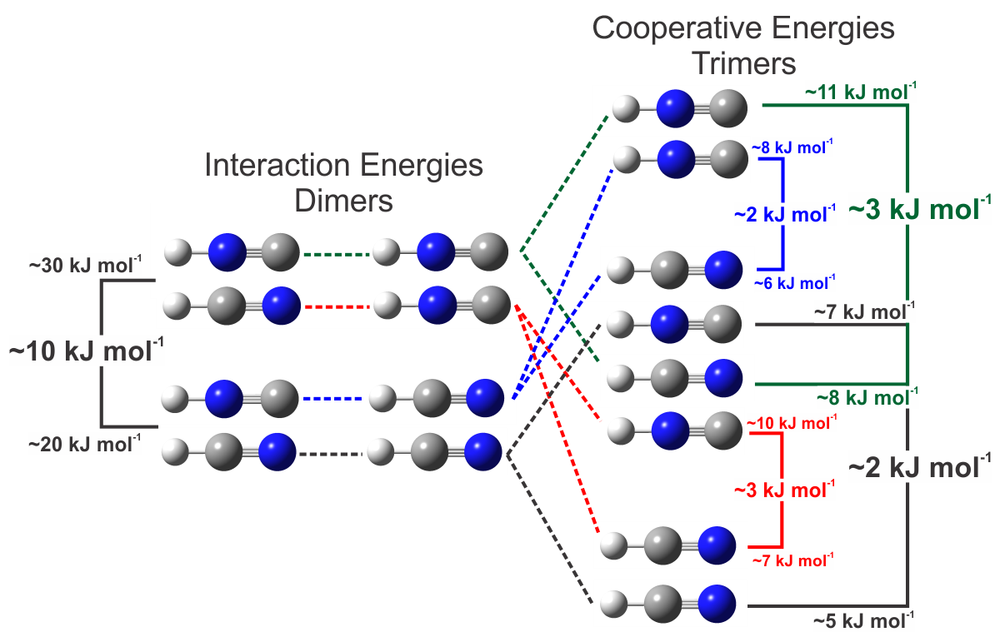

{}
[Baixe a citação](https://citation-needed.springer.com/v2/references/10.1007/s00894-017-3235-x?format=refman&flavour=citation).
{}

[Material Suplementar.](https://static-content.springer.com/esm/art%3A10.1007%2Fs00894-017-3235-x/MediaObjects/894_2017_3235_MOESM1_ESM.docx)